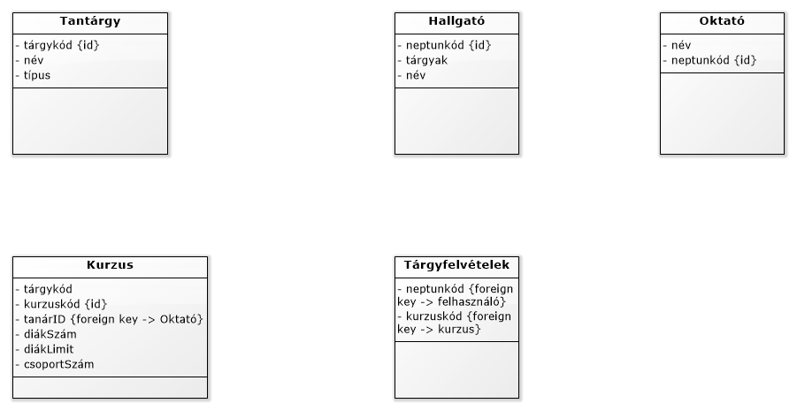
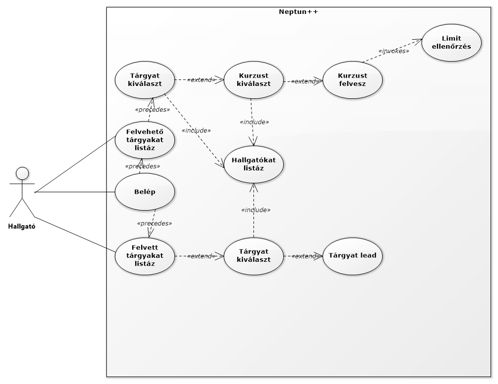
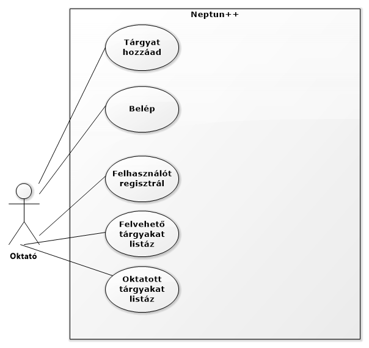
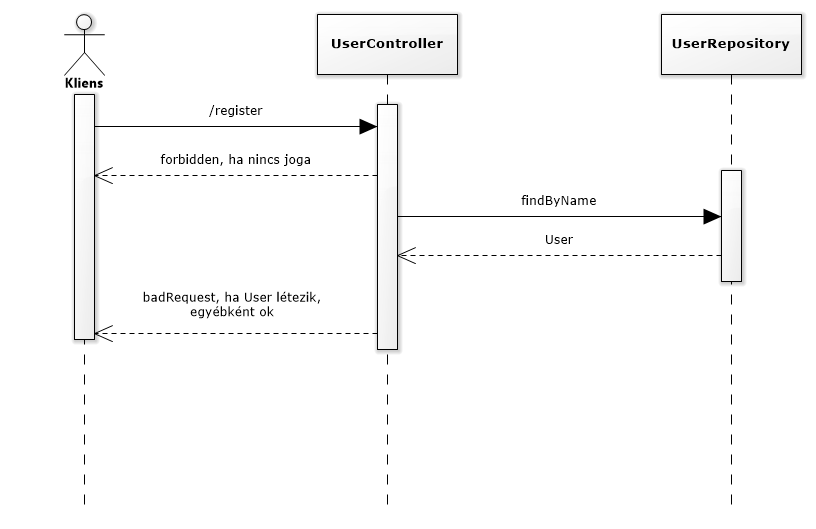
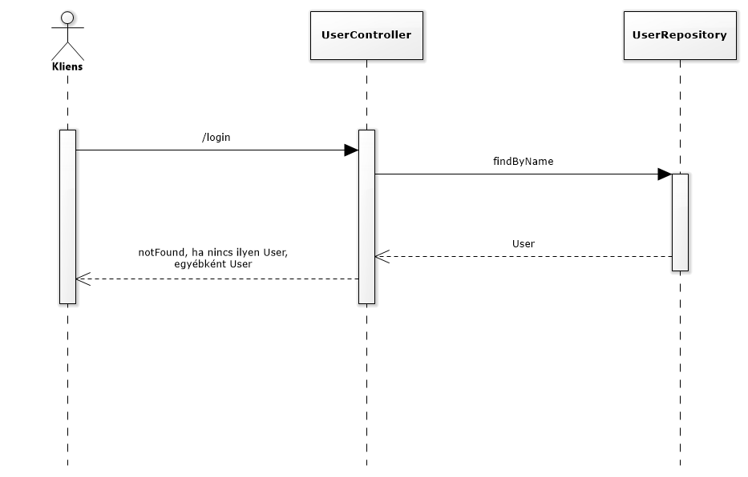
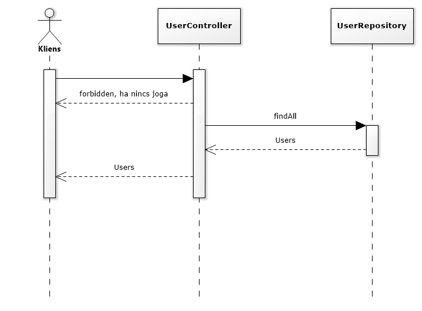
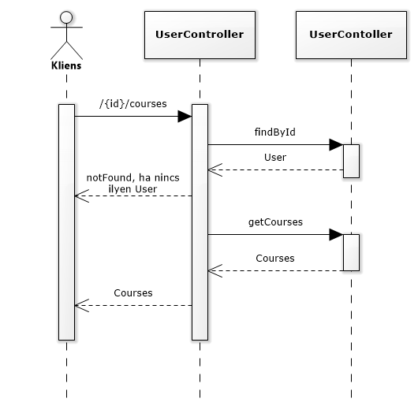
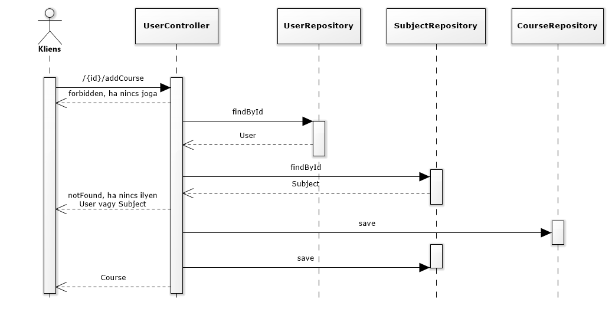
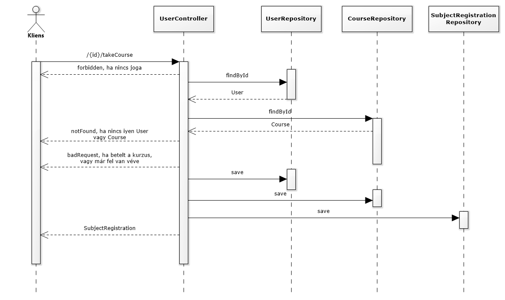
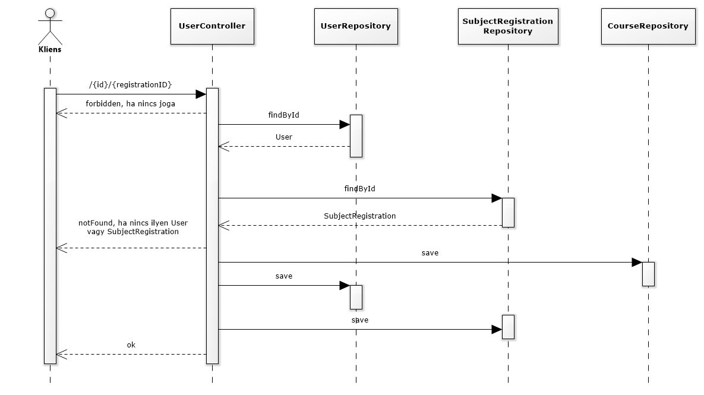

# Neptun++

### Funkcionális követelmények:
* regisztráció
* bejelentkezés
* felvehető tárgyak listázása (minkenki)
* felvett tárgyak listázása (adott személy)
* tárgy(ak) felvétele (adott személy)
* tárgy(ak) leadása (adott személy)
* tárgy(ak) hozzáadása (admin)
* hallgató(k) hozzáadása (admin)

### Nem funkcionális követelmények:
* felhasználóbarát felület
* jelszavak biztonságos tárolása
* listázások gyors megjelenítése

### Szerepkörök:
* Oktató/Admin - Tud tárgyat hozzáadni
* Hallgató - Tud tárgyat felvenni

### Végpontok:
* felhasználók/
* felhasználók/{ID}/tárgyak
* felhasználók/{ID}/tárgyFelvétel
* felhasználók/{ID}/tárgyLeadás
* tárgyak/
* tárgyak/{ID}/kurzusok
* kurzusok/
* kurzusok/{ID}/tanár
* kurzusok/{ID}/diákSzám
* kurzusok/{ID}/diákLimit
### Adatbázisok:
* Tárgyak
* Felhasználók
* Kurzusok
* Tárgyfelvételek

### Használati esetek:

### Szekvencia diagramok:

* regisztrálás

* belépés

* felhasználók lekérése

* kurzusok lekérése

* kurzus hozzáadása

* kurzus felvétele

* kurzus leadása

