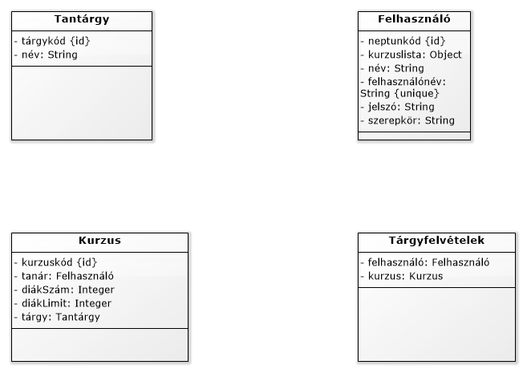

# Neptun++

### Funkcionális követelmények:
* felvehető tárgyak listázása (minkenki)
* felvett tárgyak listázása (adott személy)
* tárgy(ak) felvétele (adott személy)
* tárgy(ak) leadása (adott személy)
* tárgy(ak) hozzáadása (admin)
* hallgató(k) hozzáadása (admin)

### Nem funkcionális követelmények:
* hallgatók listázása egy tárgyon (mindenki)

### Szerepkörök:
* Tanár/Admin - Tud tárgyat hozzáadni
* Diák - Tud tárgyat felvenni

### Végpontok:
* felhasználók/
* felhasználók/tárgyak (paraméter: ID)
* tárgyak/
* tárgyak/kurzusok (paraméter: ID) 
* kurzusok/
* kurzusok/tanár (paraméter: ID)
* kurzusok/diákSzám (paraméter: ID)
* kurzusok/diákLimit (paraméter: ID)
### Adatbázisok:
* Tárgyak
* Hallgató
* Oktató
* Kurzusok
* Tárgyfelvételek

### Használati esetek:

###